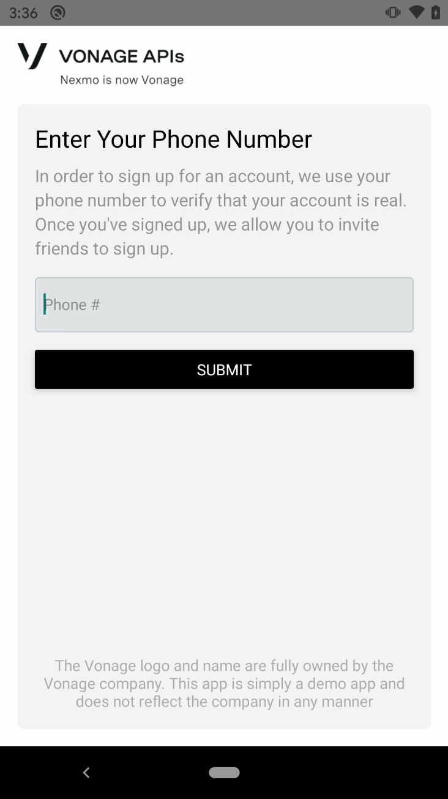
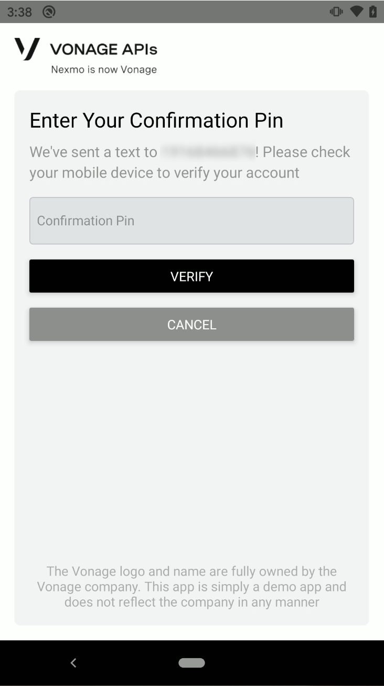

This page is the demo code for the app's UI with mocked data to replace the server as a starting point. To see more, go to the master branch

# Testing the App

## Pre-requisites

- [Have Android Studio installed](https://developer.android.com/studio)
- [Have Node 10+ installed](https://nodejs.org/en/download/)
- [Have React Native configured properly](https://reactnative.dev/docs/getting-started)
- [Have `yarn` installed](https://yarnpkg.com/getting-started/install)

## Setup

First, start by cloning the repo:

```
git clone https://github.com/crutchcorn/vonage-phone-verify-notificaitons-app.git
```

Once the project is cloned, run `yarn` to install dependencies for both React Native and the Express server at once:

```
cd vonage-phone-verify-notificaitons-app
yarn install
```

Finally, once that is done, and the server and ngrok are running, you can run the final command to start the React Native app loading in Android:

```
cd react-native
yarn android
```

# App Screenshots





