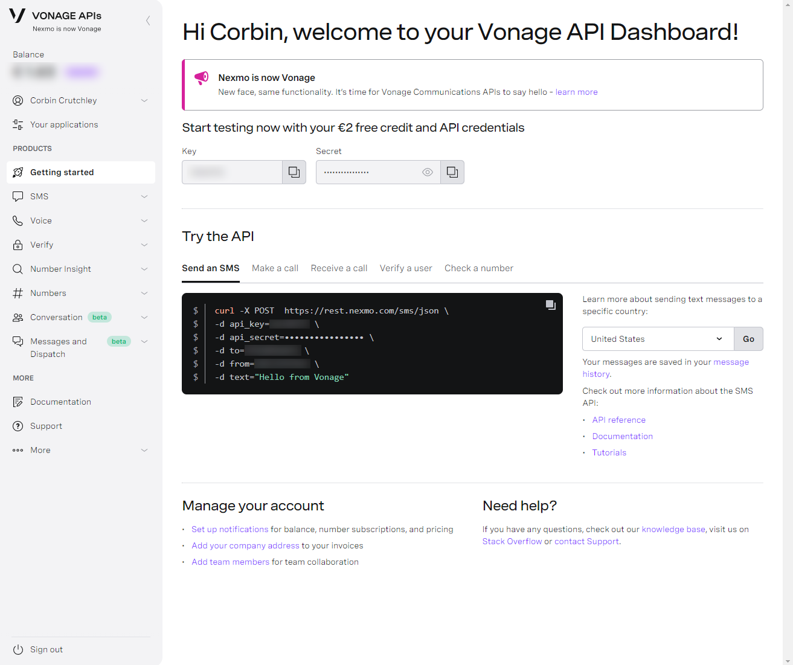
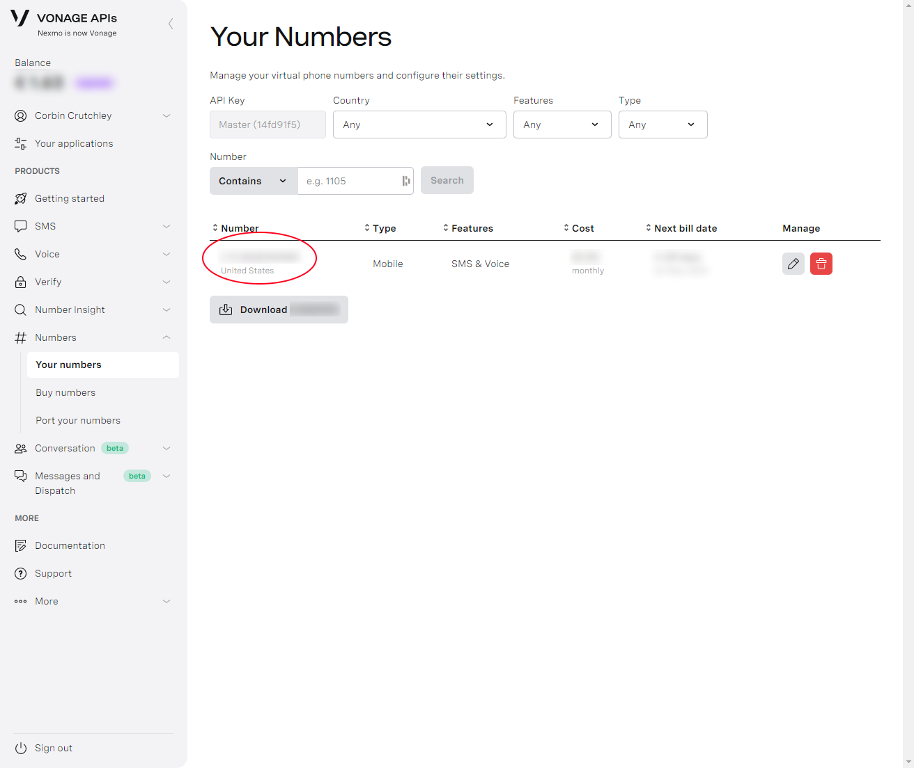
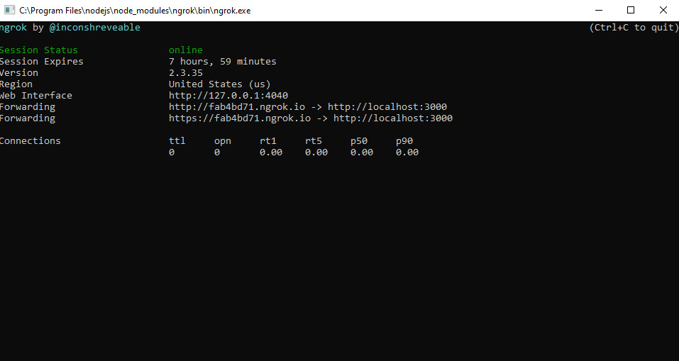

This project is a demo application written in React Native. It showcases how you can enforce a "Phone number verification" component to your auth system using [Vonage APIs](https://www.vonage.com/). In order to enable this functionality in your app, there is a backend server written in NodeJS using Express.

This app also contains functionality to send text messages to your contacts in order to invite them to use the app. This could be particularly useful if you're wanting to create a social aspect to your app

> This codebase is meant as a showcase of how to integrate Vonage APIs into your own app. To keep the code unopinionated and minimally focused on the Vonage integration, the demo code does not have any actual authorization or functionality outside of demonstrating the APIs.
>
> Additionally, to keep my own API usage low, I've chosen not to deploy the server or the app. Instead, follow the instructions below to test the app yourself.

# Testing the App

## Pre-requisites

- [Have Android Studio installed](https://developer.android.com/studio)
- [Have Node 10+ installed](https://nodejs.org/en/download/)
- [Have React Native configured properly](https://reactnative.dev/docs/getting-started)
- [Have `yarn` installed](https://yarnpkg.com/getting-started/install)
- [Install `ngrok` globally](https://www.npmjs.com/package/ngrok)

## Setup

First, start by cloning the repo:

```
git clone https://github.com/crutchcorn/vonage-phone-verify-notificaitons-app.git
```

Once the project is cloned, run `yarn` to install dependencies for both React Native and the Express server at once:

```
cd vonage-phone-verify-notificaitons-app
yarn install
```

You'll then need to configure the Vonage API keys.

First, go to `/express` and copy the `.env.bak` file into a `.env` file. We'll fill data from your Vonage account here.

Second, make sure you have a Vonage account. You can [creating a Vonage account for free to get started](https://dashboard.nexmo.com/sign-in). 

Once done, take note of your API key and API secret on the "Getting Started" tab:


Store these values under the `NEXMO_API_KEY` and `NEXMO_API_SECRET` values respectively. Then, find the number that's associated with your Vonage account. Go to "Numbers" > "Your numbers":



And store the number in `NEXMO_NUMBER` on the `.env` file. You'll want to store the country code and number without any additional symbols, just the numbers.

## Usage

In order to use the app with the server, you'll want to start three terminal instances in the `vonage-phone-verify-notificaitons-app` folder.

The first one should run the following commands to start the server:

```
cd express
yarn develop
```

The second terminal window should start `ngrok` on your machine, to allow the app to connect to it:

```
ngrok http 3000
```

This should bring up a window like this one. Copy the `ngrok.io` link, we'll need it later


Before we start the third and final window to start the debug mode of the React Native app, we'll need to edit some code in `/react-native/src/contants.js`. Simply change the `SERVER_BASE` variable to match a string of the NGROK URL and you should be all set.

Finally, once that is done, and the server and ngrok are running, you can run the final command to start the React Native app loading in Android:

```
cd react-native
yarn android
```

# App Screenshots


